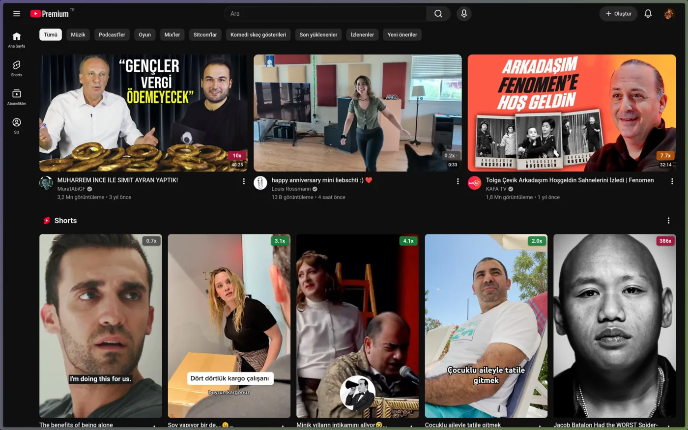
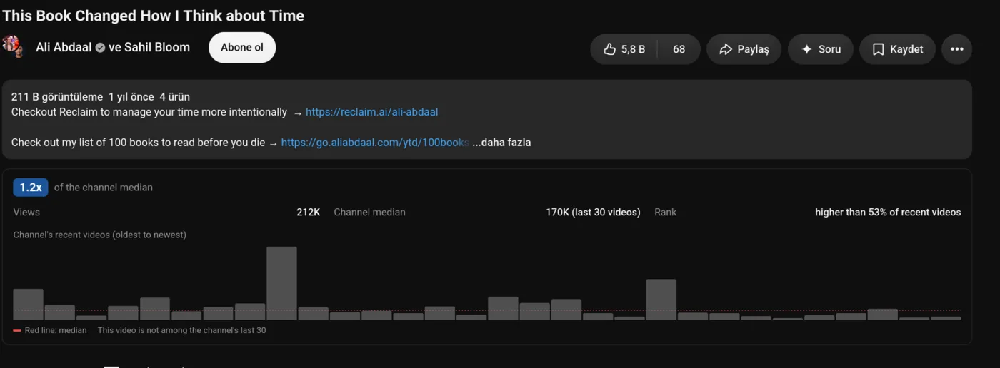

# Outlier Badge

[English](README.md)

YouTube'da her video kartının köşesine outlier skorunu basan Firefox eklentisi.
Skor = videonun izlenmesi / kanalın son N videosunun izlenme **medyanı**. Medyan
bilerek seçildi: tek bir viral video ortalamayı yukarı çekip aynı kanalın diğer
videolarını "outlier değil" gösterirdi. Shorts kendi havuzunda, normal videolar
kendi havuzunda puanlanır, canlı yayınlar hiçbir havuza girmez. Video sayfasında
ayrıca skorun ayrıntısı ve kanalın son videolarının izlenme dağılımı görünür.

Sunucu, API anahtarı, hesap yok: eklenti youtube.com içinden YouTube'un kendi
dahili (InnerTube) ucuna oturumsuz istek atar. Kanal başına bir istek, sonucu
`storage.local` içinde varsayılan 24 saat tutulur, kartlar ancak ekrana girince
işlenir.

## Kurulum

[addons.mozilla.org'dan yükleyin](https://addons.mozilla.org/tr/firefox/addon/youtube-outlier-badge/).
Bunun yerine buradaki kodu çalıştırmak için: `about:debugging#/runtime/this-firefox`
→ **Geçici Eklenti Yükle** → bu dizindeki `manifest.json`, Firefox kapanınca
kaybolur.

## Kullanım

Araç çubuğundaki simge ayarları açar: rozetleri kapat, Shorts'u puanlama, baseline
boyutu (son 15/30/60/90 video), belirli bir skorun altını gizle, önbellek ömrü,
arayüz dili ve önbellek temizleme. Aynı pencerede o sekmede kaç kartın taranıp
kaçının skorlandığı yazar, rozet çıkmıyorsa nedeni oradan görünür. Arayüz Türkçe
ve İngilizce, varsayılan olarak tarayıcının diline uyar.

Ayrıştırma ve skor mantığını tarayıcı açmadan denemek için `node test/check.js`
(gerçek bir kanal çağrısı da atar).

## Bilinen sınırlar

- Kanal izlenmeleri YouTube tarafından yuvarlanmış gelir ("1.2M views"), skor
  yaklaşık bir orandır, kesin değildir.
- 7 günden yeni videolar henüz izlenme toplamamıştır, skorları olduğundan düşük
  çıkar. Rozetin yanındaki nokta bunu işaretler.
- Baseline kanalın son N videosudur, tüm geçmişi değil. Büyüyen bir kanalda eski
  bir video hak ettiğinden yüksek skor alır.
- Üyelere özel videoların izlenmesi dışarıya hiç verilmiyor: ne baseline'a
  girerler ne de puanlanabilirler.
- Havuzda 3'ten az video kalırsa skor hesaplanmaz, rozet çıkmaz.
- InnerTube resmi olmayan bir arayüz. YouTube alan adlarını değiştirirse rozet
  kaybolur, sayfa bozulmaz.

## Lisans

GPL-3.0-only. Bkz. [LICENSE](LICENSE).
